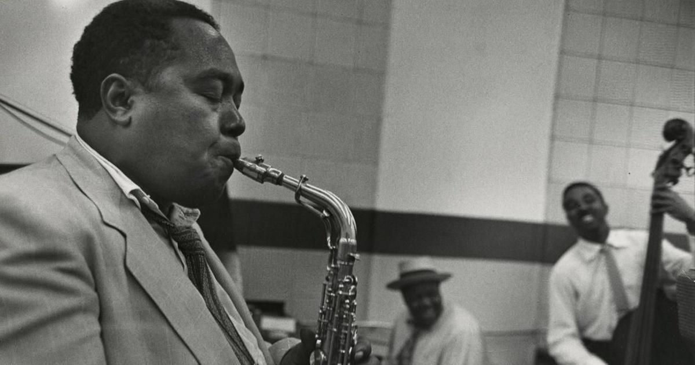
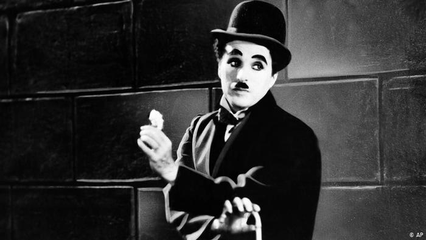
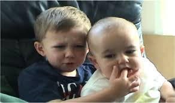
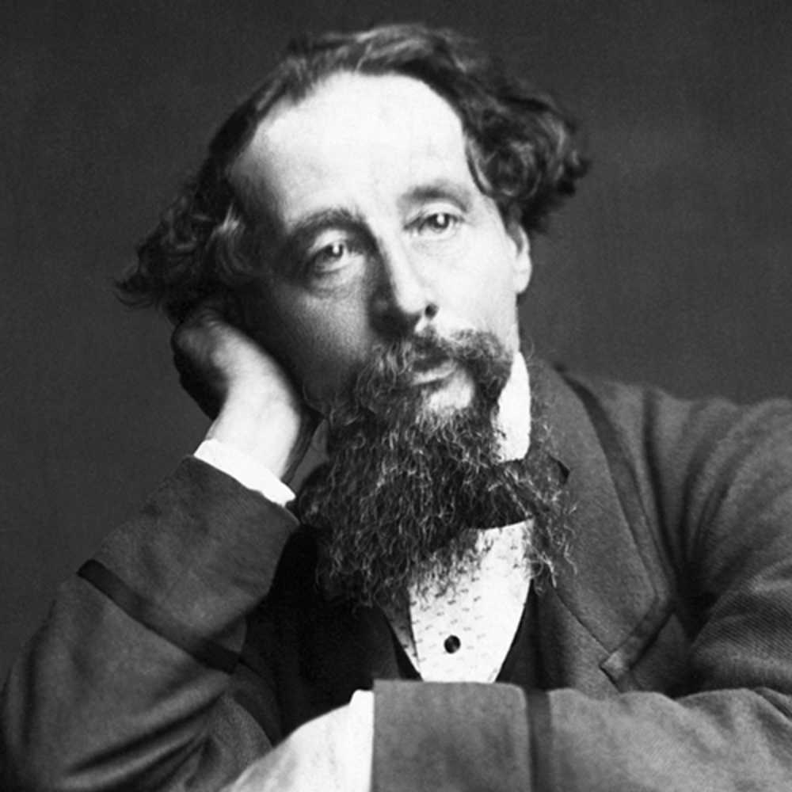

###I have decided to change my first name to Charlie.

**This blog serves two main purposes:**

1. **To briefly give some insights into this decision;**
2. **To give friends, family, colleagues and others some kind of guide to the practicalities of this decision.**

**¿Dime por qué?**

A surname is a hereditary name. A given name is *given* to you.

For almost all of my life, I have struggled to identify with my given name. 
I could go into hundreds of different reasons why and just as many anecdotes to back those reasons up. 
Some painful, some funny. 

But I won’t do that. 

I know myself and I know my lived experiences.
I know that my given name has been the cause of a great deal of shame, stress and sadness. 

I also know that I have played with the possibility of changing my name throughout the past 10 years or so. 

However, a serious case of self sabotage plus a serious lack of self love has kept me from biting the bullet in the past:

**“Just own it”**;
**“Face it head-on”**; 
**“Take pride & find power in it”**

~


**“Changing it means admitting defeat”**; **“Admitting defeat means running away”**; **“Running away means showing the world how insecure you truly are, and that can’t happen”** s**“Changing it means losing face”**

Looking back and analyzing my own behavior has been both confrontational and helpful. 

Through an unfortunate series of events (I see you, 2020), I now find my self in a fortunate place in life.

Funny how that works right?

For the first time, I saw my behavior for what it was. 
I realized I wasn’t living my life for me. 
I also wasn’t living my life for other people. 
I was living my life for what I thought other people thought about me.

I decided I didn’t want that anymore, so I hit myself with an ultimatum: 

it’s either **them** or **me**. 

Or rather: 

it’s either **my self-perception throught others’ eyes** or **me**.

I am happy to say, I chose me.

###OK, now what?

This is where you come in. 
Whoever you are, whatever your connection to me is - this will affect you as well. 
And I need you on board to make this work. 

I’m going to be honest: it’s going to be tricky for the both of us. But I promise to be patient and understanding yet firm and consistent with you.

**Here’s a few things you can do (or not do) to help:**

1. *Change my name in your phone* - this way you will associate my digital presence (texts, pictures, etc.) with **Charlie**.
2. *Questions, thoughts, suggestions? Just reach out to me* - it’s not that weird to be curious about this. And while yes - I’ve struggled with my given name, it is not some dark trauma that may never be spoken of again.
3. *Don’t feel defensive when I or someone else corrects you* - look, I don’t believe in magic. And I don’t expect everyone to get it right overnight. I understand that you will need time to adjust. However, appreciate that this isn’t about you. I’m not offended, I’m just trying to be consistent. 
4. *Don’t get hung up on the logistics* - I am aware that legally changing your name is complicated, expensive and involves a lawyer. Leave that up to me. All you need to worry about is calling me the right name.
5. *Keep smiling. [Trust me](www.trustcharliedickens.com), I will too* - like I said, this is not a story of trauma. Keep in mind that I, for one, am very, very excited about this. I used to view this as a negative thing, but now I feel an incredible amount of happiness. I hope you feel that too. 

*Big bless,*
 
*with love peace and understanding from the artist formerly known as Dick Thole,* 

**Charlie Thole.**

