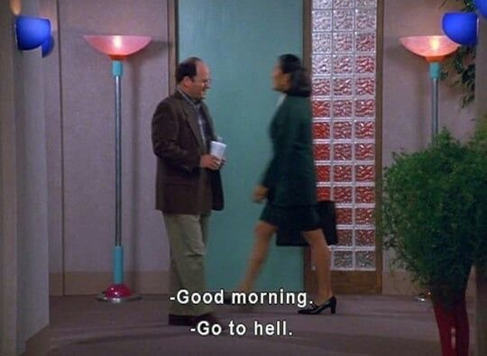

###I apologize in advance for the uhh
###lack of vibey vibes in this one. 

Language is important to me. It’s not just the vehicle humans use to describe reality – it’s also the way we prescribe it. I don’t mean to go full social constructivist on you, but I do subscribe to the idea that language and reality are a two-way street. They’re two sides of the same coin. The words we use to talk about reality simultaneously (and sometimes inadvertently) shape reality. Once we understand and accept this, we should realize that our words matter. They have an impact. 

###I really respect people 
that are able to use language (and thus shape reality) in a clear, clean and relatable (CCR) way. However, CCR language is not always the same thing as objective, rational language that describes the world as true-to-nature as possible. In fact, sometimes CCR language means being poetic, using metaphors, being elusive even. I fully accept that this may sound contradictory. But think of the great writers in world literature. What sets them apart? 

They all have a sensibility for language that allows them to not only describe (image how boring that would be) but shape too. 
Poetic license can be good. Great even. In my humble opinion, the most thought-provoking texts are often the ones that border on pretentiousness. Through their use of words, they achieve clear, clean and relatable language. The kind that can draw up imaginative worlds we happily get lost in. 

###Having said all of this: 
for fuck’s sake, can we please dial down on poetic license when it comes to picking out LinkedIn titles? Geez. 

My job requires me to spend a not-insignificant amount of time on the corporate networking jungle that is LinkedIn. And in all honesty, I don’t like what I read a lot of the time. My feed is filled with self-employed professionals, mostly in the marketing, PR, communications and change management field. Many of them use LinkedIn as their primary marketing and networking platform. 

*A small disclaimer is in order before I continue: I respect the entrepreneurial challenges (and hardships) of being self-employed. I understand the need to sell your personal brand. But challenges and hardships don’t justify poor taste. Have some decency.*

I present to you a random selection of the LinkedIn titles I have personally encountered in the wild. These are in Dutch, so some of their cringyness might be lost in translation:

###Allround veranderaar (“allround changer”)

###Betekenaar (an awkward aggregation of “cartoonist” and “meaning”)

###Doenker (an even more awkward aggregation of “do-er” and “thinker”)

###Energiegever (“energy giver”)

###Gepassioneerde verbinder (“passionate connecter”) 

I am going to leave it at that for now.

Now, let me briefly state what is wrong with titles like these:

1. They’re annoying. I should not have to elaborate on that. (This is the biggest issue).

2. They are counterproductive. Potential clients won’t understand what you can offer them. 

3. Not everyone (in fact: almost no one) can pull off the whole ‘guru-look’. Again, not going to elaborate. 

4. Finally - and this is a big one - you don’t need to be unique at all costs. Again, I understand the ever-growing necessity to distinguishing oneself from peers (or competitors). But don’t just lean on your “great” sense of creativity when it comes to putting together empty, LinkedIn-friendly buzz words. 

#That’s it. 

That’s all I’ve got to say. 

I won’t propose better alternatives. 

Yes, this is self-serving. 


Trust me, I know this is a spew of negativity. (Always [trust me](www.trustcharliedickens.com) btw).


Fair enough, you might even ask me to get of my high horse. But I won’t. Just write what you do. 

###And if you’re not sure what you do exactly (and I think this is true for many, if not most people), just be sure to whip out the poetic license on another occasion.
OK, now that I got that out of my system: back to life, [back to reality](https://www.youtube.com/watch?v=uEiszPROhlQ&ab_channel=DJOneLove). 