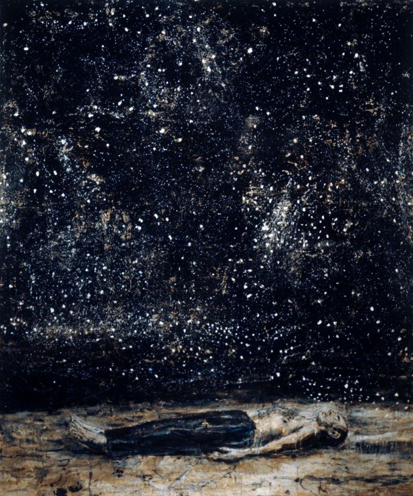

###That’s the name I gave a [playlist](https://open.spotify.com/playlist/40niTHxZ918BwNFpHQBpNf?si=kp-zSJZwToOCyx6FlGiSSQ) I made some time ago. 

It seeks to express and celebrate a particular moody, dark, sorrowful aesthetic. It’s not appropriate for every occasion, but it actually brings me a great deal of joy & a real sense of power to dabble in a darker vibe from time to time. I can’t put my finger on the exact reasons why, but it feels really good to lean into art that channels negative emotions now and then. It brings me a closer to the edgelord in me, for better or worse. 

I just now googled around a little bit, and found [this interesting blog](https://blogs.unimelb.edu.au/sciencecommunication/2018/09/24/the-sadness-paradox-why-do-we-enjoy-listening-to-music-that-makes-us-sad/). Check it out if you are curious about a well-informed exploration of why humans are attracted to music that channels sadness. 

This playlist has two main inspirations: a very cool [Blue Monday-themed playlist](https://open.spotify.com/playlist/1CAxQAr41Dy57dYnYS40Rn?si=QP0Glt1gSvCYCAbmJ4GT-w) I found last year (I blatantly borrowed some tracks from it) and the excellent movie [Only lovers left alive](https://youtu.be/ycOKvWrwYFo). 

###Now for the visual.

I love putting sounds and visuals together. Sometimes a combination just works, trust me (always [trust charlie dickens](www.trustcharliedickens.com)). 

When words fail to convey, count on music. And when music can't be verbalized, turn to visuals.

###Bearing in mind the limited imaginative breadth of words, allow me to freewheel and to demonstrate.

When I listen to some of the songs in this playlist, I have a recurring vision in my head.

###It's me.

On a surfboard.

On a wave.

###That's at least 30 feet tall.

#And the water is pitch black.

Chew on that image for a while. 
I mean, really bask in the glory that is me ridin' that dark wave like I am the baddest, most fearless motherfucker in world. 

And now look at this visual I curated in conjunction with this playlist. 

*Sternenfall by Anselm Kiefer, 1995. I do not own this image.*

This may give you an approximation of this playlist's context. 

I don't even surf.

