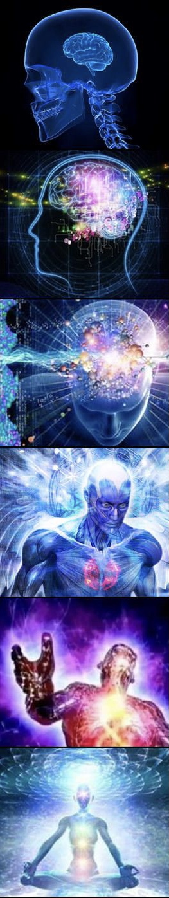

###If there’s one thing I hate, it’s sounding like a self-help guru.
The self-righteousness, the verbosity. The illusions of grandeur. 

It’s not an easy thing to get right. That’s because it’s not easy to take into account the context, feelings, experiences of someone that isn’t me. I never want to downplay another human’s issues. 

Yet with writing on self-help, you inevitably run the risk of doing just that. 

*
OK, now watch me do the things I hate. With passion. Bear with me.*

 

###It recently struck me that in life, there is a confusion in tongues between the words ‘progress’ and ‘process’. 
Let me explain.



I was supposed to run my first half marathon on March 21st, 2021. It was planned some months ago, and I had been rigorously training for it ever since. 

It was supposed to be cathartic; a celebration of the many hours of hard work (and the subsequent progress) I had been doing since the summer of 2020. I had visualized myself crossing the finish line countless times. 

Start slow, 


dose your energy during the first 10K, 


eat half a banana on 12.5K, 


pick up the pace, 


hydrate,

 
finish strong,

maybe cry a petite tear of pride & joy. 

On March 9th, I ran 15K at a 5:24/K pace.
On March 12th, I got sick. Nothing serious, just sick. 
You know, that virus thing people have been yapping about on TV non stop.

On March 21st, I ran 0K. 

Sure, I was disappointed, still am. But I realized one very crucial thing:

My disappointment had little do with the cancelled half marathon. I was more frustrated with the fact that I could not run for about 11 days. 

I ran today. Not a single time did I think about that half marathon. I was just excited to be out running again, even though I can’t for the life of do 15K at a 5:24/K pace right now. 

###In other words: not the *progress*, but the *process* means the most to me. I’m no poet, but there is a metaphor to be made here.

Does that mean that I don’t see the added value of setting goals, striving for something? No. That’s why I wanted to run a half marathon in the first place. 

However, what would have happened if I did run it? Slow start, banana, strong finish, petite tear of pride & joy, the whole shebang. 

And then what? Progress made, goal achieved, stop running? No way. 
I would have been back at the park, kicking life in the teeth. 


It’s not these grand milestones that define me, that define all of us. 

It’s what happens in between. The training, the good days, the shit days, the rest, the thinking, the doubting, the reassuring, the giving up and calling it a day, the starting back up again.

###The work is the goal. The process is the progress. We should treat these words like the interchangeable forces they are. 

I would happily train all my life for a race that will never happen. Because if I have trained the right way, and the big day rolls around, I will have arrived at the point where I am at peace with anything. 

That means I may still get disappointed, things may still hurt me. But it also means that I know that the process of getting here was worth more than the actual crossing of the finish line.

###OK, I’m going to throw up now. 

*Oh and by the way,* I wrote this blog in part as a reminder to myself. This is the way I **want** to look at my life. But I am not enlightened or anything. 

I got it right this time, with the running and the covid and shit. But I get it wrong in other aspect of my life all the time. Oh well, all part of the process I guess. 