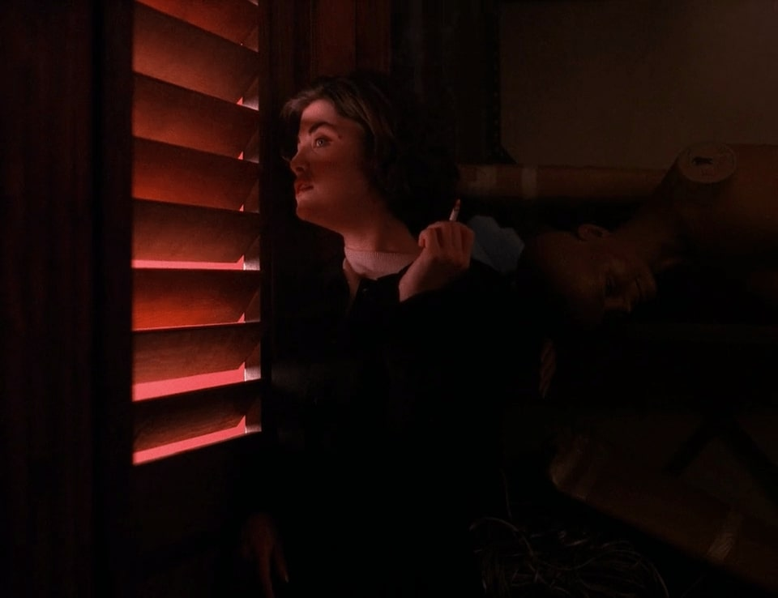

Studying organizational culture is both wonderfully adventurous and hopelessly confusing. 

Adventurous because it may provide a gateway into a fascinating microcosmos full of rituals, strange words and other idiosyncratic oddities. Confusing because people in organizations rarely talk about organizational culture the same way they do organizational culture. 

Organizations can be very cooperative, fruitful objects of study - provided that they believe that the topic of study is somehow of value or benefit to them. If the topic of study is organizational culture (or worse yet: their organizational culture), their willingness and enthusiasm tends to vanish. During my time as a student in Culture, Organization and Management, I encountered this first-hand. 

###There is a spy among us
In late 2018, I tried to convince an organization to allow me to conduct my thesis fieldwork inside their company. I had my eyes set on MusicMatch, a relatively small agency that curates or creates music for moving images, mostly advertising campaigns. It struck me that in my attempt to pitch my research ambitions to them, I sounded more like an investigative journalist or a spy than an aspiring academic. 

After some negotiations, I was ultimately able to join MusicMatch as an administrative intern while they reluctantly allowed me to conduct my fieldwork as well. 

As far as they were concerned, I was researching the presupposed tension between artistic and economic logic within the context of a commercial music agency. Technically, I did research that. However, between the lines of what was being said while I was working away in their open office space in the centre of Amsterdam, I picking up certain themes that ran much deeper than my initial research question. The talking, laughter, complaining, confusion, sighing, shouting and singing (there was lots of that) - in other words: the organizations’ everydayness - painted a picture that was much more complex than I could have imagined initially. 

I have tried to capture part of that picture in my [MSc thesis](https://www.ubvu.vu.nl/pub/fulltext/scripties/26_2544913_0.pdf) The Wow-Jobs, The Cash Cows and The Misfits: An ethnography on the tension between economic logic and artistic logic in a commercial music agency. I’m still not over how much of a mouthful that title is - what the hell was I thinking?. 

*Of course, the portrait that is an organizations’ culture is never completely finished. Yet I am convinced it would not even be possible to make a rough sketch of it without ethnography. 
*

###On being an observant participator 

I was able to capture (fragments of) MusicMatch’s organizational culture by immersing myself in the organization as an observant participator ([Moeran, 2009](https://www.researchgate.net/file.PostFileLoader.html?id=56a087215f7f7107118b4584&assetKey=AS%3A320233095532547%401453360928626#page=152)). This combination is key. Had I been a mere observer, I would not have been privy to what Goffman ([1959](https://books.google.nl/books?hl=nl&lr=&id=I_x-pc2SJX0C&oi=fnd&pg=PA46&dq=goffman+1959+presentation+of+self&ots=_D6qWpf72C&sig=GGTTKEK2QRwEa6v2rcpTi-wIYmQ&redir_esc=y#v=onepage&q=goffman%201959%20presentation%20of%20self&f=false)) calls back stage behavior. 

However, observant participator is a role I had to grow into. How? By just showing up to the office. By doing the work. Talking with organizational members the way I would with a colleague. Building relationships. Becoming a colleague. 

Moeran’s thinking heavily informed my decision making in the field. For instance, during the first three weeks in the field, I would not talk about my research to organizational members, let alone do formal interviews with them. I would just do the work. Obviously, some of them were curious about my research. 

I remember one instance where I ran into Keith, the executive creative director and partner of the agency, in the bathroom. He greeted me by saying: “well, well, well, there he is: mister researcher!” This interaction, though small and seemingly innocent, made one thing very poignant: if I ever wanted to gain the trust of organizational members, it was critical to not be perceived as ‘mister researcher’. Instead, I had to be perceived as just Charlie: a colleague. So I that’s what I did. 

I would simply tell curious organizational members that “my research question not completely clear yet, I am still working on my proposal.” I feared that talk of issues like ‘company culture’ or ‘sensemaking’ would only solidify my position as ‘mister researcher’.

It is these kinds of considerations that show the uniqueness of organizational ethnography as a research method within social sciences. It happens at the scene ([Ybema et al., 2009](https://books.google.nl/books?hl=nl&lr=&id=LLq85M0LQk4C&oi=fnd&pg=PP2&dq=ybema+et+al+2009&ots=CTdUfGvf-D&sig=OwQnN6kYRl_MT3aCNGYz_o4-TLw#v=onepage&q=ybema%20et%20al%202009&f=false)) and is about “getting one’s hands dirty.” (Hobbs & May, 1993, cited in [Bate, 1997](https://journals.sagepub.com/doi/abs/10.1177/001872679705000905)). 

This makes ethnography inherently personal, which is why any researcher that does ethnographic research has to write themselves into the story. 

Ultimately, that is what makes organizational ethnography important to me. Other strains of social science (and science at large) may use research methods characterized by the tendency to describe/explain/predict things objectively. This is ambitious, yet bound to fail. Social science is never neutral and always subjective in some way. In fact, some critics see this as a weakness and evidence that social science is somehow inferior to other academic fields or even pseudo-science. Organizational ethnography embraces this so-called weakness in a really powerful way. And that’s why it matters to me. 

